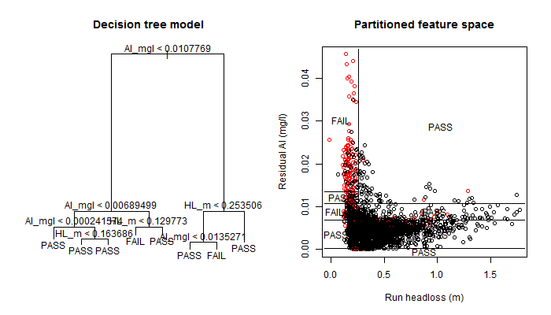

```{r, echo=FALSE, error=FALSE, warning=FALSE, message=FALSE, include= FALSE}
# Script to call neccessary r packages

# load packages

source("global.R")

```


## An expert system for RGF operation

AWWA WQTC Conference 2015

Andrew Upton

Dr Peter Jarvis

Professor Bruce Jefferson


---

## Overview

- Definitions
- Key messages
- Introduction
- Rationale
- Example of prototype system
- Further work

---

## A few definitions
- <span style="color:blue">Expert system:</span> A software system which combines a knowledge base and a reasoning mechanism to solve a problem in a specific domain
- <span style="color:blue">Machine learning:</span> The application of generalisable algorithms which can develop data driven models to assist prediction or decision making
- <span style="color:blue">Hybrid system:</span> A system which uses more than one branch of artificial intelligence to perform a function

---

## Key messages

- Many <span style="font-weight:bold">SCADA</span> systems are <span style="color:green; font-weight:bold">good at collecting data </span> but <span style="color:red; font-weight:bold"> bad at helping us understand it.</span>
- Effective use of <span style="font-weight:bold">process data can inform decisions and reduce risk.</span>
- Process investigations can be focused on key areas, reducing cost and disruption.
- Combining expert process knowledge and machine learning methods can provide <span style="color:green; font-weight:bold">valuable insights for treatment operation, maintenance and enhancement</span>.

--- 

## Filtration

<div style='text-align: center;'>
    
</div>

---

## Challenges

```{r, echo=FALSE, cache=FALSE, results='asis', warning= FALSE, error=FALSE}

sysdiag<- DiagrammeR::grViz("
      digraph neato {
      graph [rankdir = LR, bgcolor=transparent, color = Black] 
      

      node [shape = circle,
      fontname = Helvetica, color = Black, fontcolor = Black]
      E [label = 'Water treatment\nmanagement\nchallenges']

      node [shape = box,
      fontname = Helvetica, color = Black, fontcolor = Black]
      A [label = 'Process']
      B [label = 'Asset']
      C [label = 'Operation']
      D [label = 'Data']
      
      edge[color = Black]
          
      E->A E->B E->C E->D
      }
      ", width=650, height=400, engine="dot")

htmlwidgets::saveWidget(sysdiag, 'fltmg_diag.html', background = "transparent")
cat('<iframe src="fltmg_diag.html" width=850 height=500 allowtransparency="true" scrolling="no"> </iframe>')

```

---

## Turbidity

- Filtration performance is typically monitored in terms of turbidity because it is <span style="color:orange; font-weight:bold">robust</span> and <span style="color:orange; font-weight:bold">cheap</span>
- Turbidity measurement is <span style="color:orange; font-weight:bold">subject to interferences</span> particularly at the levels of interest.
- The relationships between turbidity, particles, micro-organisms and pathogen risk are weak and inconsistent.
- Comparison of turbidity values at different times or from different systems is not the same as comparing risk.

---

## Filter performance

- We want to maintain <span style="color:orange; font-weight:bold">multiple barriers</span> to pathogens and particles.
- Filtrate turbidity <span style="color:green; font-weight:bold">less than 0.1 NTU </span> is considered to indicate that a barrier is likely to be effective and the that performance is acceptable or <span style="color:green; font-weight:bold">good</span>.
- Filtrate turbidity <span style="color:red; font-weight:bold"> greater than 0.1 NTU </span> is considered to indicate that a barrier is likely to be less effective and that performance should be improved or is <span style="color:red; font-weight:bold">poor</span>.
- It is more useful and informative to understand the occurence and context of good and poor perfomance than to compare turbidity values obtainted under different conditions and at different times.

---

## Previous work

- Expert systems for alarm management (Dandy & Simpson 1991)
- Improved tools for monitoring control signals (Liukkonen et al 2013)
- Filter maintenance and operation guidance manual (Logsdon et al, 2002)
- Partnership for safe water filtration turbidity performance scheme
- Application of SQC for cryptosporidium control (Hall et al 2001)
- Many applications of machine-learning for coagulant dose optimization

---

## Aims for system

Develop an interactive software tool combining process data and expert knowledge to facilitate:

- rapid assessment, comparison and communication of filter performance over the medium term
- identify the most likely dominant causes of poor filtration performance over the medium term

---

## Tools

<center> <center>

https://www.r-project.org/

https://www.rstudio.com/

---

## Case study:

```{r, echo=FALSE, cache=FALSE, results='asis', warning=FALSE, error=FALSE}

sys<- DiagrammeR::grViz("
      digraph neato {
      graph [rankdir = LR, bgcolor=transparent, color = Black] 
      
      node [shape = box,
      fontname = Helvetica, color = Black, fontcolor = Black]
      A [label = 'RAW\nWATER']
      B [label = 'LIME\nDOSING']
      C [label = '4x\nTREATMENT\nSTREAMS']
      D [label = 'ALUMINIUM\nSULFATE']
      E [label = 'POLYMER']
      F [label = '4 x 6\nDIRECT\nRGFs']
    
     
      edge[color = Black]
          
      A->B B->C C->D D->E E->F 
      }
      ", width=650, height=200, engine="dot")

htmlwidgets::saveWidget(sys, 'sys_diag.html', background = "transparent")
cat('<iframe src="sys_diag.html" width=850 height=200 allowtransparency="true" scrolling="no"> </iframe>')

```

- SCADA data used from February 2013 to September 2014 which includes `r nrow(RUNSTATS)` filter runs of which `r nrow(RUNSTATS[RUNSTATS$RUN_FAIL  == 1,])` have turbidity indicative of poor performance.
- A filter run is considered <span style="color:orange; font-weight:bold">poor</span> if the <span style="color:orange; font-weight:bold">99th percentile </span>turbidity of data collected at 15 minute intervals<span style="color:orange; font-weight:bold"> >0.1 NTU</span>

---

## Data processing

```{r, echo=FALSE, cache=FALSE, results='asis', error=FALSE}

sys<- DiagrammeR::grViz("
      digraph neato {
      graph [rankdir = LR, bgcolor=transparent, color = Black] 
      
      node [shape = box,
      fontname = Helvetica, color = Black, fontcolor = Black]
      A [label = 'SCADA\ndata']
      C [label = 'Aggregation\non run']
      D [label = 'Run\nclassification']
      F [label = 'Diagnostic\nAlgorithm']

      node [shape = circle,
      fontname = Helvetica, color = Black, fontcolor = Black]
      G [label = 'Graphical\nUser\nInterface']
      
      edge[color = Black]
          
      A->C C->D D->F F->G D->G
      }
      ", width=750, height=250, engine="dot")

htmlwidgets::saveWidget(sys, 'data_diag.html', background = "transparent", selfcontained = TRUE)
cat('<iframe src="data_diag.html" width=850 height=250 allowtransparency="true" scrolling="no"> </iframe>')

```

**FILTER**   | **RUN**    | **T99<0.1NTU?** | **PREDICTOR1** | **...**  | **PREDICTORn**
------------|-----------|--------------|-----------|-----|-----------
1           |  1       |  PASS       |    0.3     |...  |    5.1
1           |  2       |  PASS       |    0.4     |...  |    5.2
1           |  3       |  PASS       |    0.3     |...  |    5.3
2           |  1       |  PASS       |    0.5     |...  |    5.2
2           |  2       |  FAIL       |    0.9     |...  |    5.1
2           |  3       |  PASS       |    0.3     |...  |    5.2

---

## Graphical user interface

A demo of the system can be found at:

www.andrewupton.net

---

## Comparative performance of filters 

```{r, echo=FALSE, error=FALSE}
run_brk<- RUNSTATS[,length(RUN), by = list(FILTER_ID, RUN_FAIL) ]
run_brk<- run_brk[,RUN_FAIL := factor(RUN_FAIL, labels = c("PASS", "FAIL"))]

run_bar <- nPlot(V1 ~ FILTER_ID, group = 'RUN_FAIL', data = run_brk, type = 'multiBarChart')
run_bar$chart(color = c( 'green', 'red'))
run_bar$chart(reduceXTicks = FALSE)
run_bar$chart(margin = list(left = 90, bottom = 160))
run_bar$xAxis(rotateLabels=-90, axisLabel = "Filter")
run_bar$yAxis( axisLabel = "Count of filter runs")
run_bar$set(width = 650, height = 400)
run_bar$save("failurebars.html")
```

```{r, echo=FALSE, warning=FALSE, results="asis"}
cat('<iframe src="failurebars.html" width=750 height=500 allowtransparency="true" scrolling="no" > </iframe>')

```

---

## Comparative performance of filters 2

```{r echo=FALSE, error= FALSE, results= "hide"}
MTBF<-ddply(FAILURES, .(FILTER_ID,STREAM),summarise,
                                    mtbf = round(sum(as.numeric(c(STRT, ymd("14/09/01")))-as.numeric(c(ymd("13/02/01"), END)))/length(RUN)/(60*60*24),1))
MTBF<-MTBF[order(MTBF$mtbf, decreasing = TRUE),]

mtbfplot <- nPlot(mtbf ~FILTER_ID ,  data = MTBF, type = 'discreteBarChart')
mtbfplot$set(width = 650, height = 400)
mtbfplot$chart(margin = list(left = 90, bottom = 160), color =list(dput(MTBF$COL)))
mtbfplot$chart(
color = "#! function(d){
    var ourColorScale = d3.scale.ordinal().domain(['1','2','3','4']).range(['red','blue','orange','purple']);
    return ourColorScale(d.STREAM);
    }!#")
mtbfplot$xAxis(rotateLabels=-90, axisLabel = "Filter")
mtbfplot$yAxis( axisLabel = "Mean time between failures (days)")
mtbfplot$save("mtbfplot.html")
```

```{r echo=FALSE, results = 'asis', warning = FALSE, error=FALSE}
cat('<iframe src="mtbfplot.html" width=750 height=500 allowtransparency="true" scrolling = "no" > </iframe>')
```

---

## Performance timeline

```{r echo=FALSE, results='asis'}
timeline<- gvisTimeline(data=FAILURES[STREAM == '3'|STREAM == '4' & STRT < ymd('14/06/01')], 
             rowlabel="FILTER_ID",
             barlabel="FAILTYPEA",
             start="STRT", 
             end="END",
             options=list(title = "Run failure timeline",
                          height=1200,
                          width = 1000,
                          colors="['#0000FF', '#00FFFF', '#0099FF']",
                          timeline="{colorByBarLabel:true}"))

print(timeline, tag = "chart")
```

---

## Breakdown of failure types

```{r echo=FALSE, results='asis'}
fail_brk<- FAILURES[STRT>ymd("13/02/01") & STRT <ymd("14/09/01") ]
fail_brka<- ddply(fail_brk, .( HIGH_PERIOD,FILTER_ID),summarise,
                  count = length(RUN))
colnames(fail_brka)<- c("from","to","count")
fail_brkb<- ddply(fail_brk, .( FILTER_ID,FILTERS_IMPACTED),summarise,
                  count = length(RUN))
colnames(fail_brkb)<- c("from","to","count")
fail_brk<-rbind(fail_brka,fail_brkb)

sankey<-gvisSankey(fail_brk, from="from", 
           to="to", weight="count",
           options=list(
               height=500,
               width = 700,
               sankey="{link:{color:{fill:'#d799ae' }}}"
           ))

print(sankey, tag = "chart")

```

---

## Cusum charts

```{r , echo= FALSE, cache=FALSE, warning=FALSE, error=FALSE}
qcc_dat<- RUNSTATS_MEL[variable == "RUN_HL" & FILTER == "2" & STRT > ymd("14/06/15")& STRT < ymd("14/9/15")]
qcc_dat<- qcc_dat[,cusum_day_mean :=  mean(value), by = list(year(STRT),yday(STRT))]
qcc_dat<- qcc_dat[,cusum_day :=  cumsum(value-cusum_day_mean), by = FILTER_ID]
trend_zoos_cusum<- dlply(qcc_dat, .(FILTER_ID), .fun = zoowrap_cusum)
trend_zoos_cusum<- do.call(what = merge, args =trend_zoos_cusum)
cusum<-dygraph(trend_zoos_cusum, main = "Normalised Run Headloss Cusum") %>%
                                  dyOptions(drawPoints = TRUE, pointSize = 2, strokeWidth = 0)%>%
                                  dyRangeSelector(height = 20)%>%
                                  dyAxis("y", label = "Cumulative difference from daily mean (m)")
saveWidget(cusum, file = "cusum.html", selfcontained = TRUE, background = "transparent")

```

```{r echo=FALSE, results = 'asis', warning = FALSE, error=FALSE}
cat('<iframe src="cusum.html" width=750 height=500 allowtransparency="true" scrolling = "no"> </iframe>', fill = FALSE)
```

--- 

## Expert diagnosis

1. Identify behaviours in process signals that are indicative of specific types of fault.
2. Aggregate the signals to best describe these behaviours over the filter run.
3. Identify the signal behaviours which best predict poor filter performance.
4. Link the strongest predictors of poor performance to the most likely dominant causes.
5. Confirm with a directed investigation.

---

## Fault tree

```{r, echo=FALSE, cache=FALSE, results='asis', warning=FALSE, error=FALSE}

sys<- DiagrammeR::grViz("
      digraph neato {
      graph [rankdir = LR, bgcolor=transparent, color = Black] 
      
      node [shape = box,
      fontname = Helvetica, color = Black, fontcolor = Black]
      A [label = 'Expert knowledge\nof system']
      B [label = 'Expert knowledge\nfrom literature']
      C [label = 'SCADA data']
    
      node [shape = circle,
      fontname = Helvetica, color = Black, fontcolor = Black]
      E [label = 'Largest\nresolvable\nfault tree']
      
      edge[color = Black]
          
      A->E B->E C->E 
      }
      ", width=650, height=400, engine="dot")

htmlwidgets::saveWidget(sys, 'diag_diag.html', background = "transparent")
cat('<iframe src="diag_diag.html" width=850 height=500 allowtransparency="true" scrolling="no"> </iframe>')

```

---

## Diagnostic process

```{r, echo=FALSE, cache=FALSE, results='asis', warning=FALSE, error=FALSE}

ml<- DiagrammeR::grViz("
      digraph neato {
      graph [rankdir = LR, bgcolor=transparent, color = Black] 
      
      node [shape = box,
      fontname = Helvetica, color = Black, fontcolor = Black]
      A [label = 'Table of\nrun data']
      B [label = 'Training\ndata']
      C [label = 'Test\ndata']
      H [label = 'User\ninterface']
      I [label = 'Expert\nvariable\nweighting']
      J [label = 'Model\nperformance']
      G [label = 'Cross\nvalidation']


      node [shape = circle,
      fontname = Helvetica, color = Black, fontcolor = Black]
      D [label = 'Random forest\nclassifier\ntraining']
      F [label = 'Candidate\ncause\nscoring'] 
      E [label = 'Variable\nimportance\nquantification']

      edge[color = Black]
          
      A->B A->C B->D D->E E->F D->G C->G F->H G->J J->H I->F
      }
      ", width=650, height=400, engine="dot")

htmlwidgets::saveWidget(ml, 'ml_diag.html', background = "transparent")
cat('<iframe src="ml_diag.html" width=850 height=500 allowtransparency="true" scrolling="no"> </iframe>')

```


---

## Classification trees

```{r , echo=FALSE, warning=FALSE, results= "hide"}
TREE_DAT<- RUNSTATS%>%filter(STREAM == "1")%>%select (RUN_FAIL, RUN_HL, STREAM_AL_MEAN)
setnames(TREE_DAT,colnames(TREE_DAT)[2:3], c("HL_m","Al_mgl"))

set.seed(3)
tree_mod<- tree(factor(RUN_FAIL, labels = c("PASS", "FAIL"))~ HL_m+Al_mgl, data = TREE_DAT)

png(filename = "IMAGES/tree_visplot.png", width = 700, height = 400, units = "px", bg = "transparent")

par(mfrow=c(1,2))

plot(tree_mod)
text(tree_mod)
title("Decision tree model")

plot(TREE_DAT$HL_m,TREE_DAT$Al_mgl, col = factor(TREE_DAT$RUN_FAIL),
                    xlab = "Run headloss (m)", ylab = "Residual Al (mg/l)", main = "Partitioned feature space")
partition.tree(tree_mod, add = TRUE, ordvars = c("HL_m", "Al_mgl"))


dev.off()

```



---

## Random forest algorithm

```{r, echo=FALSE, cache=FALSE, results='asis', warning=FALSE, error=FALSE}
rf<- DiagrammeR::grViz("
      digraph neato {
      graph [rankdir = BT, bgcolor=transparent, color = Black] 
      
      node [shape = box,
      fontname = Helvetica, color = Black, fontcolor = Black]
      A [label = 'Tree\n(v1, v7, v9)']
      B [label = 'Tree\n(v1, v5, v6)']
      C [label = 'Tree\n(v2, v7, v9)']
      D [label = 'Tree\n(v1, v2, v6)']
      E [label = 'Tree\n(v3, v5, v9)']
      F [label = 'Tree\n(v5, v7, v8)']
      G [label = 'Tree\n(v1, v3, v4)']


      node [shape = circle,
      fontname = Helvetica, color = Black, fontcolor = Black]
      H [label = 'Random forest\nclassifier']

      edge[color = Black]
          
      A->H B->H C->H D->H E->H F->H G->H
      }
      ", width=650, height=400, engine="dot")

htmlwidgets::saveWidget(rf, 'rf_diag.html', background = "transparent")
cat('<iframe src="rf_diag.html" width=850 height=400 allowtransparency="true" scrolling="no"> </iframe>')
```

---

## Model performance and varaiable importance

<iframe align="center">
```{r echo=FALSE, results='asis', warning=FALSE}
kable(cont_tab)
```
</iframe>

```{r, echo=FALSE, warning=FALSE }
varimpplot <- nPlot(MeanDecreaseGini ~variable ,  data = RF_IMP[RF_IMP$RANK < 20,], type = 'discreteBarChart')
          #                   varimpplot$chart(reduceXTicks = FALSE)
          varimpplot$chart(margin = list(left = 90, bottom = 200))
          varimpplot$xAxis(rotateLabels=-90, axisLabel = "Variable")
          varimpplot$yAxis( axisLabel = "Score")
          varimpplot$save("varimpplot.html")
```

```{r echo=FALSE, results = 'asis', warning = FALSE, error=FALSE}
cat('<iframe src="varimpplot.html" width=750 height=500 allowtransparency="true" scrolling = "no"> </iframe>', fill = FALSE)
```


---
## Expert decision matrix


.           | **Cause 1** | **Cause 2**  | **Cause 3** |**...**  | **Cause n**
------------|---------|----------|---------|-----|-----------
**Var 1**       |  1      |  0       |  0      |...  |    0
**Var 2**       |  0.3    |  0.3     |  0.3    |...  |    0
  .             |   .      |   .       |   .     |...   |     .   
  .             |   .      |   .       |   .     |...   |     .   
  .             |   .      |   .       |   .     |...   |     .   
**Var n**       |  0      |  0       |  0.5    |...  |    0.5


---

## Suggested causes

```{r, echo=FALSE, warning=FALSE }
causeplot <- nPlot(score ~cause ,  data = diag_tab, type = 'discreteBarChart')
          #                   causeplot$chart(reduceXTicks = FALSE)
          causeplot$chart(margin = list(left = 90, bottom = 200))
          causeplot$xAxis(rotateLabels=-90, axisLabel = "Potential cause")
          causeplot$yAxis( axisLabel = "Score")
          causeplot$save("causeplot.html")
```

```{r echo=FALSE, results = 'asis', warning = FALSE, error=FALSE}
cat('<iframe src="causeplot.html" width=750 height=500 allowtransparency="true" scrolling = "no"> </iframe>', fill = FALSE)
```

---

## Next steps

- Shift from using whole runs to periods within runs
- Use of higher frequency data
- Full scale online trial system
- Adaptation to multiple sites with different treatment processes
- Greater specificity in fault diacnosis
- Automatic suggestion of follow up actions

---

## Summary

- The value of process data often not realised.
- Providing improved data analysis tools to the operators and engineers who are most familiar with the treatement assets could facilitate improved compliance and reduced risk


--- {smaller}

## References 

- Dandy, G. C., & Simpson, A. R. (1991). Development of expert systems for a water filtration plant. Civil Engineering Systems, 8, 63–70.
- Logsdon, G., Hess, A., Chipps, M. J., & Rachwal, A. (2002). Filter Maintenance and Operations Guidance Manual. American Water Works Association.
- Liukkonen, M., Juntunen, P., Laakso, I., & Hiltunen, Y. (2013). A software platform for process monitoring: Applications to water treatment. Expert Systems with Applications, 40(7), 2631–2639. 
- Hall, T., Realey, G., & Watts, M. (2001). APPLICATION OF STATISTICAL PROCESS CONTROL IN WATER TREATMENT FOR MANAGING CRYPTOSPORIDIUM RISK Report Ref. No. 00/DW/06/15.


---

## R Packages

<div style="font-size:12pt">
- Ramnath Vaidyanathan (2012). slidify: Generate reproducible html5 slides from R markdown. R package version 0.5. http://ramnathv.github.com/slidify/

- M Dowle, T Short, S Lianoglou, A Srinivasan with contributions from R Saporta and E Antonyan (2014). data.table:  Extension of data.frame. R package version 1.9.4. 

- Garrett Grolemund, Hadley Wickham (2011). Dates and Times Made Easy with lubridate. Journal of Statistical Software, 40(3), 1-25.

- Hadley Wickham (2011). The Split-Apply-Combine Strategy for Data Analysis. Journal of Statistical Software,   40(1), 1-29.

- Hadley Wickham and Romain Francois (2015). dplyr: A Grammar of Data Manipulation. R package version 0.4.3.

- Hadley Wickham (2007). Reshaping Data with the reshape Package. Journal of Statistical Software, 21(12), 1-20.

- Achim Zeileis and Gabor Grothendieck (2005). zoo: S3 Infrastructure for Regular and Irregular Time Series. Journal of Statistical Software, 14(6), 1-27.

- Winston Chang, Joe Cheng, JJ Allaire, Yihui Xie and Jonathan McPherson (2015). shiny: Web Application Framework for R. R package version 0.12.2.

- Winston Chang (2015). shinydashboard: Create Dashboards with 'Shiny'. R package version 0.5.1.

- Ramnath Vaidyanathan (2013). rCharts: Interactive Charts using Javascript Visualization Libraries. R package version 0.4.5.
</div>

---

## R packages cont

<div style="font-size:12pt">
Scrucca, L. (2004). qcc: an R package for quality control charting and statistical process control. R News 4/1,  11-17.
  
Markus Gesmann and Diego de Castillo. Using the Google Visualisation API with R. The R Journal, 3(2):40-44,  December 2011.  

Winston Chang and Hadley Wickham (2015). ggvis: Interactive Grammar of Graphics. R package version 0.4.2.
  
Lawrence M, Huber W, Pages H, Aboyoun P, Carlson M, et al. (2013) Software for Computing and Annotating
  Genomic Ranges. PLoS Comput Biol 9(8)

Dan Vanderkam and JJ Allaire (2015). dygraphs: Interface to Dygraphs Interactive Time Series Charting Library. R  package version 0.4.5.
  
Stephen Milborrow (2015). rpart.plot: Plot rpart Models.  An Enhanced Version of plot.rpart. R package version   1.5.2. 
  
Brian Ripley (2015). tree: Classification and Regression Trees. R package version 1.0-36.

A. Liaw and M. Wiener (2002). Classification and Regression by randomForest. R News 2(3), 18--22.
</div>


---

## Many thanks to..


